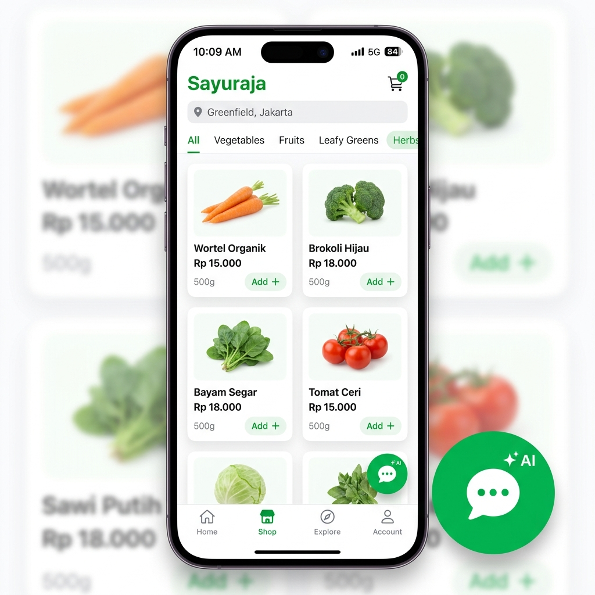

# Changelog

Semua perubahan signifikan pada proyek **Sayuraja** akan didokumentasikan di file ini.

## [1.3.0] - 2026-05-07

### Added
- **E2E Testing with Playwright**: Implementasi pengujian end-to-end otomatis untuk menjamin stabilitas fitur utama.
- **Automated Test Scenarios**: Pengujian untuk alur pemilihan produk, kalkulasi harga di order bar, dan interaksi Chat Widget.
- **API Mocking**: Setup infrastruktur mocking API untuk pengujian yang lebih cepat dan terisolasi tanpa ketergantungan pada backend live.
- **Test Scripts**: Penambahan perintah `test:e2e` dan `test:e2e:ui` di package manager untuk kemudahan pengembangan.

## [1.2.0] - 2026-05-06

### Added
- **AI Safeguards & Anti-Hallucination**: Implementasi aturan grounding yang ketat agar AI hanya menjawab berdasarkan basis pengetahuan (Google Sheets) dan menolak pertanyaan di luar topik.
- **Qwen3 Embedding Model**: Migrasi model embedding dari `bge-m3` ke `@cf/qwen/qwen3-embedding-0.6b` untuk akurasi pencarian semantik yang lebih tinggi dan dukungan konteks yang lebih luas (32k tokens).

### Changed
- **System Prompt Refinement**: Pengoptimalan instruksi sistem untuk menjaga kepribadian "Admin Sayuraja" tetap ramah namun profesional dalam batasan informasi yang tersedia.

## [1.1.0] - 2026-05-03

### Visual Highlights
| Feature | Before (v1.0.0) | After (v1.1.0) |
| :--- | :--- | :--- |
| **Search & AI** |  |  |
| **Selection** | 📄 Read-only List |  |
| **Checkout** | 💬 Manual Chat | 📱 WhatsApp Pre-filled |

### Added
- **Multi-Item Selection**: Fitur untuk memilih beberapa produk sekaligus dengan indikator visual "Terpilih".
  > 
- **Floating Order Bar**: Bar dinamis di bagian bawah layar yang menampilkan jumlah item dan total estimasi harga secara real-time.
  > 
- **WhatsApp Pre-filled Message**: Otomatisasi pesan WhatsApp yang berisi daftar belanjaan detail (nama produk, harga, unit) dan total harga.
- **Sticky AI Search Bar**: Re-layout Chat Widget menjadi kolom pencarian yang menempel di atas daftar produk.
  > 
- **Search-to-Chat Transition**: Panel AI Assistant yang melebar (expand) saat pengguna berinteraksi dengan bar pencarian.

### Changed
- **Branding Refresh**: Migrasi total dari nama "Sayuraya" ke **"Sayuraja"** di seluruh kode, URL deployment, dan repositori GitHub.
- **UI/UX Enhancement**: Header lebih bersih dan penggunaan `backdrop-blur` pada elemen sticky untuk tampilan lebih modern.

### Fixed
- **Backend Stability**: Penanganan error "Cannot read properties of undefined (reading 'trim')" dengan menambahkan guard clauses pada Environment Variables di Cloudflare Workers.
- **CORS Configuration**: Perbaikan header CORS untuk mendukung komunikasi antara frontend dan backend di domain produksi.

## [1.0.0] - 2026-05-02

### Added
- **Initial MVP Release**: Peluncuran perdana Sayuraja.
- **Google Sheets Integration**: Sinkronisasi katalog produk dan basis pengetahuan operasional langsung dari spreadsheet.
- **AI Concierge**: Chat widget melayang dengan integrasi Cloudflare Workers AI (Vectorize & BAAI/BGE-M3).
- **Product Catalog Display**: Tampilan kartu produk dengan kategori, harga, dan status stok.
- **Admin Sync**: Tombol sinkronisasi tersembunyi untuk memperbarui memori AI secara manual.

---
*File ini dikelola secara otomatis mengikuti perkembangan fitur Sayuraja.*
