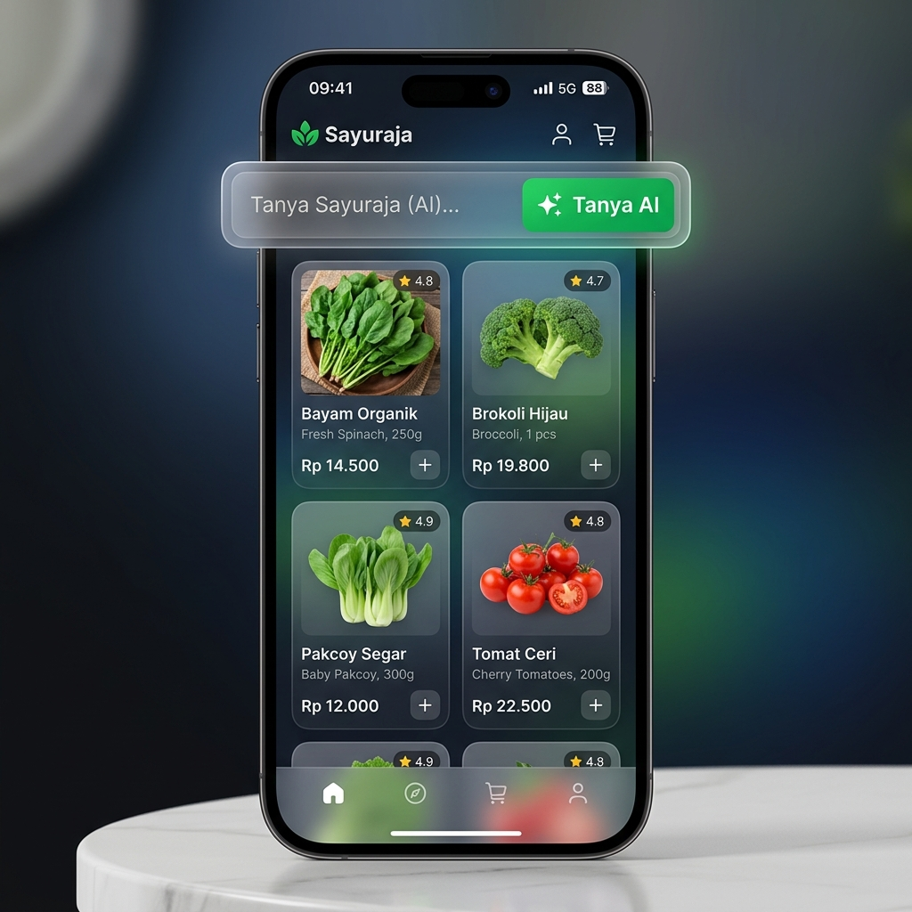

# Sayuraja 🥬
### Automated Produce Concierge: From Discovery to Conversion with AI



**Sayuraja** is an AI-powered retail assistant designed to eliminate the operational bottleneck between social media engagement (Instagram/TikTok/Facebook) and final sales conversion (WhatsApp). By leveraging Retrieval-Augmented Generation (RAG) at the edge, Sayuraja provides instant, accurate, and friendly responses to customer inquiries about price and stock, 24/7.

---

## ✨ The Problem vs. The Solution

| The Old Way 🐢 | The Sayuraja Way ⚡ |
| :--- | :--- |
| Customer asks price in IG comments. | Customer clicks bio link, enters AI storefront. |
| Admin manually checks Product Catalog price & stock. | AI instantly queries Vector Database at the edge. |
| Hours of delay → Customer loses interest. | **< 2s response time** → Instant conversion. |
| Manual WhatsApp order formatting. | One-click **"Order via WhatsApp"** with pre-filled cart. |

---

## 🚀 Key Features

- **🤖 RAG-Powered AI Chat**: Uses high-performance LLMs grounded in your actual stock data to prevent hallucinations.
- **⚡ Edge-First Architecture**: Built on Cloudflare Workers for near-zero latency and instant global delivery.
- **📊 Google Sheets as Headless CMS**: Non-technical staff can update prices, stock, product data in a simple spreadsheet.
- **📱 Built for In-App Browsers**: Optimized for the Instagram/TikTok/Facebook built-in browsers with a lightweight, mobile-first React interface.
- **🛒 Smart Conversion**: Automatically formats customer orders into a single clear WhatsApp message.

---

## 🏗️ Technical Architecture

<!-- Sayuraja is a masterclass in modern, serverless, edge computing: -->

- **Frontend**: React + TypeScript + Vite + Tailwind CSS + Shadcn UI.
- **Compute**: Cloudflare Workers (Serverless Edge Functions).
- **AI Services**: Cloudflare Vectorize (Vector Database) + Workers AI (Embedding & LLM).
- **Data Source**: Google Sheets API.
<!-- - **Hosting**: Cloudflare Pages. -->

---

## 🛠️ Getting Started

### Prerequisites
- [Bun](https://bun.sh) runtime.
- Cloudflare Account with Workers & Vectorize enabled.
- Google Sheets API Credentials.

<!-- ### Quick Setup

1. **Clone & Install**:
   ```bash
   git clone https://github.com/youruser/sayuraja.git
   cd sayuraja
   bun install
   ```

2. **Frontend Configuration**:
   Create `frontend/.env` based on `.env.example`:
   ```env
   VITE_BACKEND_URL=your_worker_url
   VITE_WHATSAPP_NUMBER=628...
   ```

3. **Backend Secrets**:
   ```bash
   cd backend
   # Set your secrets in Cloudflare
   npx wrangler secret put GEMINI_API_KEY
   npx wrangler secret put GOOGLE_SHEETS_API_KEY
   npx wrangler secret put GOOGLE_SHEET_ID
   ```

4. **Deploy**:
   ```bash
   # Deploy Backend
   cd backend && npx wrangler deploy
   
   # Deploy Frontend
   cd frontend && bun run build && npx wrangler pages deploy dist
   ``` -->

---

## 📈 Success Metrics
- **60% Reduction** in repetitive DM inquiries.
- **P95 Latency < 2s** for AI responses.
- **Zero Hallucination** stock reporting through RAG grounding.

---

<!-- ## 🗺️ Roadmap
- [ ] **Multi-Admin Support**: Handle multiple branch locations.
- [ ] **Image Recognition**: Allow customers to upload a photo of a vegetable to identify and price it.
- [ ] **Voice-to-Text**: Enable voice queries for a hands-free shopping experience.

--- -->

<!-- Developed with ❤️ by the Sayuraja Team. *Segar Tiap Pagi, Langsung ke Rumah.* -->
